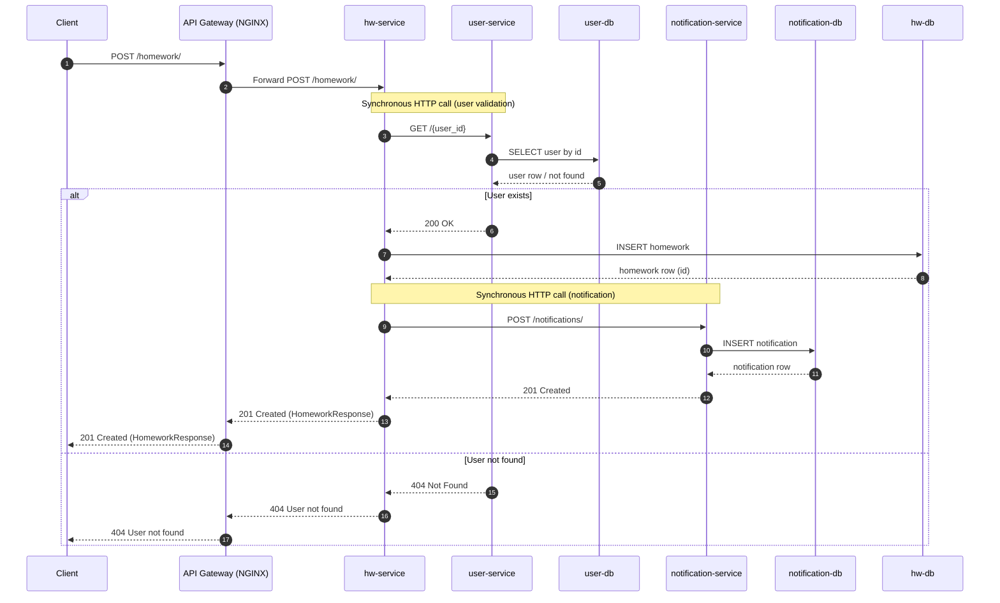

```mermaid
sequenceDiagram
    autonumber
    participant C as Client
    participant N as API Gateway (NGINX)
    participant H as hw-service
    participant U as user-service
    participant UD as user-db
    participant NS as notification-service
    participant ND as notification-db
    participant HD as hw-db

    C->>N: POST /homework/
    N->>H: Forward POST /homework/

    Note over H,U: Synchronous HTTP call (user validation)
    H->>U: GET /{user_id}
    U->>UD: SELECT user by id
    UD-->>U: user row / not found

    alt User exists
        U-->>H: 200 OK

        H->>HD: INSERT homework
        HD-->>H: homework row (id)

        Note over H,NS: Synchronous HTTP call (notification)
        H->>NS: POST /notifications/
        NS->>ND: INSERT notification
        ND-->>NS: notification row
        NS-->>H: 201 Created

        H-->>N: 201 Created (HomeworkResponse)
        N-->>C: 201 Created (HomeworkResponse)

    else User not found
        U-->>H: 404 Not Found
        H-->>N: 404 User not found
        N-->>C: 404 User not found
    end
```
