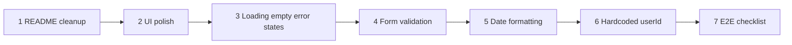

# HomeworkManager Demo Polish Plan

Focused, incremental checklist to make HomeworkManager demo-ready by polishing README/setup docs, frontend UX, validation, date display, hardcoded user handling, and a manual E2E test script. No backend or architecture changes.

**Current baseline (confirmed working):**
- Docker Compose stack on port 8080
- Vite frontend on port 5173 with `/api` proxy to gateway ([`frontend/vite.config.js`](../frontend/vite.config.js))
- List + create homework flows work for hardcoded `userId = 1` ([`frontend/src/App.jsx`](../frontend/src/App.jsx))

**Out of scope:** backend API changes, auth, delete/edit homework, notification UI, automated test suite, production deployment.

---

## Recommended order (incremental)



Each task is independently shippable; later tasks build on earlier ones but do not block backend functionality.

---

## Task 1 — README / local setup cleanup

**Status:** Complete

**Goal:** A new developer can start backend + frontend and reach a working UI in one pass, without hitting the prior ECONNREFUSED / HTTP 500 confusion.

**Files likely involved:**
- [`README.md`](../README.md) (primary)
- [`frontend/README.md`](../frontend/README.md) (replace Vite boilerplate or point to root README)
- [`test.sh`](../test.sh) (fix `/apiusers/` typo on line 11; align paths with `/api/` prefix)
- Optional cross-link: [`RCA-api-homework-users-500.md`](RCA-api-homework-users-500.md)

**Implementation notes:**
- Add a **"Full local demo"** section with two terminals:
  1. `docker compose up -d --build` (note: README currently mixes `docker-compose` and `docker compose`)
  2. `cd frontend && npm install && npm run dev`
- State explicitly: **frontend requires backend on `localhost:8080`**; Vite proxy errors surface as HTTP 500 in the browser.
- Fix architecture gateway paths to consistently use `/api/` prefix (section 4 still says `/users/*` without `/api`).
- Add **frontend** to Project Structure tree (`frontend/`, `nginx/`, `docs/`).
- Document seed step before first UI load:
  ```bash
  curl -X POST http://localhost:8080/api/users/ \
    -H "Content-Type: application/json" \
    -d '{"name":"Demo User","email":"demo@example.com","grade_level":"11"}'
  ```
- Add prerequisites: **Node.js 18+** and npm (in addition to Docker).
- Keep existing curl-based API testing; add a short "Web UI demo" subsection linking to `http://localhost:5173`.

**Acceptance criteria:**
- README documents backend-first startup order and frontend proxy dependency.
- All documented curl URLs use the `/api/` prefix and match [`nginx/nginx.conf`](../nginx/nginx.conf).
- `test.sh` POST user URL is `/api/users/` (not `/apiusers/`).
- Project structure lists `frontend/` directory.
- No contradictory gateway path examples remain.

---

## Task 2 — Frontend UI polish

**Goal:** Replace prototype inline styles and leftover Vite template globals with a clean, demo-presentable single-page layout.

**Files likely involved:**
- [`frontend/src/App.jsx`](../frontend/src/App.jsx) — remove inline `style={{...}}`; use CSS classes
- [`frontend/src/App.css`](../frontend/src/App.css) — repurpose (currently unused Vite boilerplate)
- [`frontend/src/index.css`](../frontend/src/index.css) — fix `body { place-items: center }` centering that fights app layout
- [`frontend/src/components/AddHomeworkForm.jsx`](../frontend/src/components/AddHomeworkForm.jsx)
- [`frontend/src/components/HomeworkList.jsx`](../frontend/src/components/HomeworkList.jsx)
- [`frontend/src/components/HomeworkItem.jsx`](../frontend/src/components/HomeworkItem.jsx)
- [`frontend/src/main.jsx`](../frontend/src/main.jsx) — import `App.css` if used

**Implementation notes:**
- Prefer **CSS classes over a UI library** to keep scope small.
- Suggested layout:
  - Header: title + subtitle (current user context)
  - Card/panel for add-homework form
  - Card/panel for homework list
- Style form row: labeled fields, consistent input/button sizing, focus states (reuse existing `:root` color tokens from `index.css`).
- Homework list: card rows or styled `<ul>` with clear hierarchy (assignment name prominent, course + due date secondary).
- Remove unused Vite template rules (`.logo`, `.card`, spin animation) from `App.css`.
- Keep changes visual only — no new features in this task.

**Acceptance criteria:**
- No inline `style={{...}}` in App or components (or only minimal exceptions documented).
- Page reads as a single-column app (not centered Vite starter page).
- Form and list are visually grouped and readable at 320px–1280px width.
- Light/dark mode from `index.css` still works.

---

## Task 3 — Better loading, empty, and error states

**Goal:** Demo flow never shows a blank or confusing screen; errors explain what went wrong and how to recover.

**Files likely involved:**
- [`frontend/src/App.jsx`](../frontend/src/App.jsx) — list fetch loading/error
- [`frontend/src/components/HomeworkList.jsx`](../frontend/src/components/HomeworkList.jsx) — empty state
- [`frontend/src/components/AddHomeworkForm.jsx`](../frontend/src/components/AddHomeworkForm.jsx) — submit error
- [`frontend/src/api.js`](../frontend/src/api.js) — optional: friendlier error parsing for FastAPI `detail` JSON
- New (optional): `frontend/src/components/StatusMessage.jsx` or `frontend/src/utils/errors.js`

**Implementation notes:**
- **Loading:** skeleton rows or a centered spinner + "Loading homework…" in the list area only (keep form usable while list loads on refresh).
- **Empty:** distinguish "no assignments yet" from loading; include CTA text: "Add your first assignment above."
- **Error (list):** show message + **Retry** button calling `refresh()`; map common cases:
  - Empty body / connection failure → "Cannot reach API gateway. Is Docker running on port 8080?"
  - `HTTP 404` with user not found → "User not found. Create user 1 via README seed command."
  - Other `HTTP NNN` → show status + backend body (already partially in `api.js`)
- **Error (create):** keep inline under form; do not clear form fields on failure.
- Parse FastAPI errors when body is `{"detail":"..."}` instead of raw JSON string in `HTTP 500: {...}`.

**Acceptance criteria:**
- Initial load shows loading indicator, then list or empty state (never both error + stale data silently).
- Stopping Docker and refreshing shows actionable error with Retry.
- Empty list shows helpful message, not a bare "No homework yet."
- Create failure preserves user input and shows readable error text.

---

## Task 4 — Basic form validation

**Goal:** Prevent invalid submissions before they hit the API; show inline field errors for demo confidence.

**Files likely involved:**
- [`frontend/src/components/AddHomeworkForm.jsx`](../frontend/src/components/AddHomeworkForm.jsx) (primary)
- Optional: `frontend/src/utils/validation.js`

**Implementation notes:**
- Validate on submit (not necessarily on every keystroke):
  - **Assignment name:** trim; min 2 chars; max ~100 chars
  - **Course:** optional; if provided, trim; max ~50 chars
  - **Due date:** required; must parse as valid date; reject past dates (or same-day past time) with clear message
- Remove silent fallback `due_date: new Date().toISOString()` when empty — `required` + JS validation should block submit instead.
- Disable submit button while `saving` or when validation fails.
- Show field-level error text under each input (red, small); clear errors on field change.
- Keep HTML `required` as a baseline; JS validation provides better messages.

**Acceptance criteria:**
- Submitting empty assignment name shows inline error; no API call made.
- Submitting past due date shows inline error; no API call made.
- Valid submission still works end-to-end.
- Whitespace-only assignment name is rejected.

---

## Task 5 — Date formatting cleanup

**Goal:** Consistent, locale-friendly date display and correct ISO payload for the API.

**Files likely involved:**
- [`frontend/src/components/HomeworkItem.jsx`](../frontend/src/components/HomeworkItem.jsx)
- [`frontend/src/components/AddHomeworkForm.jsx`](../frontend/src/components/AddHomeworkForm.jsx)
- New: `frontend/src/utils/dates.js`

**Implementation notes:**
- Add small helpers in `dates.js`:
  - `formatDueDate(isoString)` — e.g. `Intl.DateTimeFormat` with `{ dateStyle: "medium", timeStyle: "short" }` (or project-consistent format)
  - `toApiDateTime(datetimeLocalValue)` — convert `datetime-local` value to ISO string the backend expects (replace manual `` `${dueDate}:00` `` hack)
- **Display:** use one format everywhere; handle invalid/missing dates with "—" or "Invalid date" (no thrown errors in render).
- **Submit:** ensure seconds/timezone are correct for FastAPI `datetime` parsing ([`hw-service/models.py`](../hw-service/models.py) `HomeworkCreate.due_date`).
- Optional: show relative hint in list ("due in 3 days" / "overdue") — only if trivial; otherwise skip to avoid scope creep.

**Acceptance criteria:**
- List items show human-readable due dates (not raw ISO strings).
- Created homework due date in UI matches what user selected in the form (no off-by-hours surprises from naive string concat).
- `dates.js` is the single place for format/parse logic.
- Invalid `hw.due_date` does not crash the list render.

---

## Task 6 — Remove or document hardcoded `userId = 1`

**Goal:** Demo no longer depends on unexplained magic number; either configurable in UI or clearly documented with seed instructions.

**Files likely involved:**
- [`frontend/src/App.jsx`](../frontend/src/App.jsx)
- [`frontend/src/api.js`](../frontend/src/api.js) — `createUser` already exists
- [`README.md`](../README.md) — demo user seed docs (from Task 1)
- Optional new: `frontend/src/components/UserBar.jsx`

**Recommended approach (minimal, demo-ready):** **Document + lightweight selector** — not full user-registration UI.

**Implementation notes:**
- **Option A (preferred for demo):** Replace `const userId = 1` with:
  - `useState` defaulting to `1`
  - Small `UserBar`: numeric input or `<select>` for user ID + "Load" / auto-refresh on change
  - Subtitle: "Showing homework for user {id}"
- **Option B (doc-only):** Keep `userId = 1` but add prominent README + in-app banner: "Demo mode: user 1. Seed with curl …"
- Do **not** build full create-user form unless time permits; `createUser` in `api.js` can stay for README curl seed only.
- On user ID change: call `listHomeworkForUser(newId)`; handle 404 with Task 3 error messaging.
- Remove stale comment in App.jsx ("Next step after refactor…") once addressed.

**Acceptance criteria:**
- Either (A) user ID is changeable in UI and list refreshes, or (B) hardcode remains with visible in-app notice + README seed steps.
- No unexplained `userId = 1` without documentation.
- Switching to non-existent user shows 404 error, not a crash.

---

## Task 7 — Manual end-to-end test checklist

**Status:** Complete

**Goal:** Repeatable demo script for presenter or grader; catches regressions like gateway-down and missing seed user.

**Files likely involved:**
- [`docs/demo-e2e-checklist.md`](demo-e2e-checklist.md)
- Cross-reference: [`README.md`](../README.md), [`test.sh`](../test.sh)

**Implementation notes:**
- Structure as checkbox markdown:
  1. **Prerequisites** — Docker running, Node installed
  2. **Backend startup** — `docker compose up -d --build`; `curl http://localhost:8080/api/health` → `ok`
  3. **Seed data** — POST user; verify `GET /api/users/1` → 200
  4. **Frontend startup** — `npm run dev`; open `http://localhost:5173`
  5. **List homework** — empty state on fresh DB; after seed, loads without error
  6. **Add homework** — fill form, submit, item appears with formatted due date
  7. **Validation** — empty name / past date blocked in UI
  8. **Error recovery** — stop Docker, refresh → error + retry; restart Docker, retry → success
  9. **API spot-check** (optional) — `curl http://localhost:8080/api/homework/users/1/homework` returns array
  10. **Notification side-effect** (optional) — `curl http://localhost:8080/api/notifications/1` after create
- Include expected HTTP status codes and sample success indicators.
- Note common failure: frontend-only without backend → Vite proxy 500.

**Acceptance criteria:**
- Checklist is self-contained and runnable in <10 minutes.
- Covers happy path and at least one failure/recovery scenario.
- Linked from README "Demo" section.
- Aligns with fixed `test.sh` paths from Task 1.

---

## File creation summary

| Action | Path |
|--------|------|
| Created | `docs/demo-polish-plan.md` (this document) |
| Created | `docs/RCA-api-homework-users-500.md` |
| Created | `docs/demo-e2e-checklist.md` |
| Pending | — |
| Edit | `README.md`, `test.sh`, `frontend/src/*`, optional `frontend/src/utils/*.js` |

---

## Demo-ready definition (done when)

- README: full-stack startup in documented order
- UI: polished layout, not Vite starter leftovers
- States: loading, empty, error all handled with recovery hints
- Form: client-side validation before API calls
- Dates: consistent display and correct API serialization
- User context: documented or selectable (not magic `1`)
- Checklist: manual E2E script verified once on a clean `docker compose down -v` run
