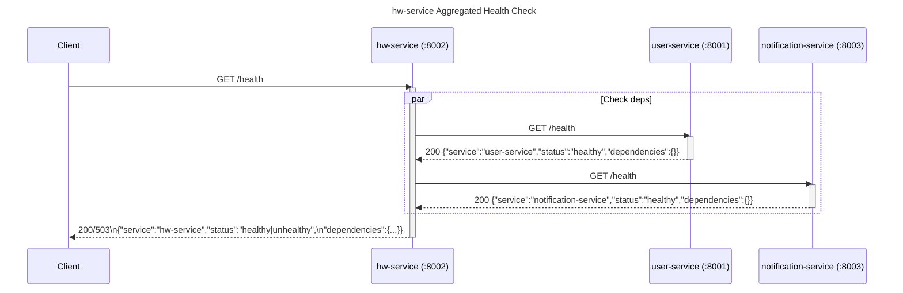

```mermaid
sequenceDiagram
    title hw-service Aggregated Health Check
    participant C as Client
    participant HW as hw-service (:8002)
    participant US as user-service (:8001)
    participant NS as notification-service (:8003)

    C->>HW: GET /health
    activate HW

    par Check deps
        HW->>US: GET /health
        activate US
        US-->>HW: 200 {"service":"user-service","status":"healthy","dependencies":{}}
        deactivate US

        HW->>NS: GET /health
        activate NS
        NS-->>HW: 200 {"service":"notification-service","status":"healthy","dependencies":{}}
        deactivate NS
    end

    HW-->>C: 200/503\n{"service":"hw-service","status":"healthy|unhealthy",\n"dependencies":{...}}
    deactivate HW
```
